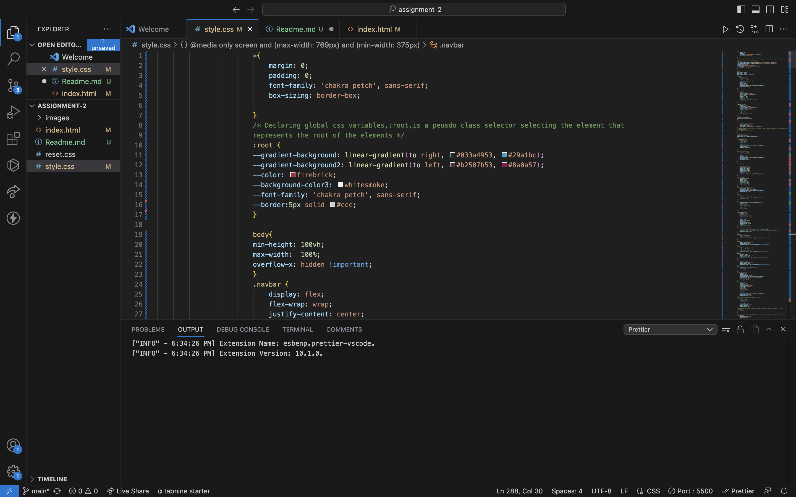
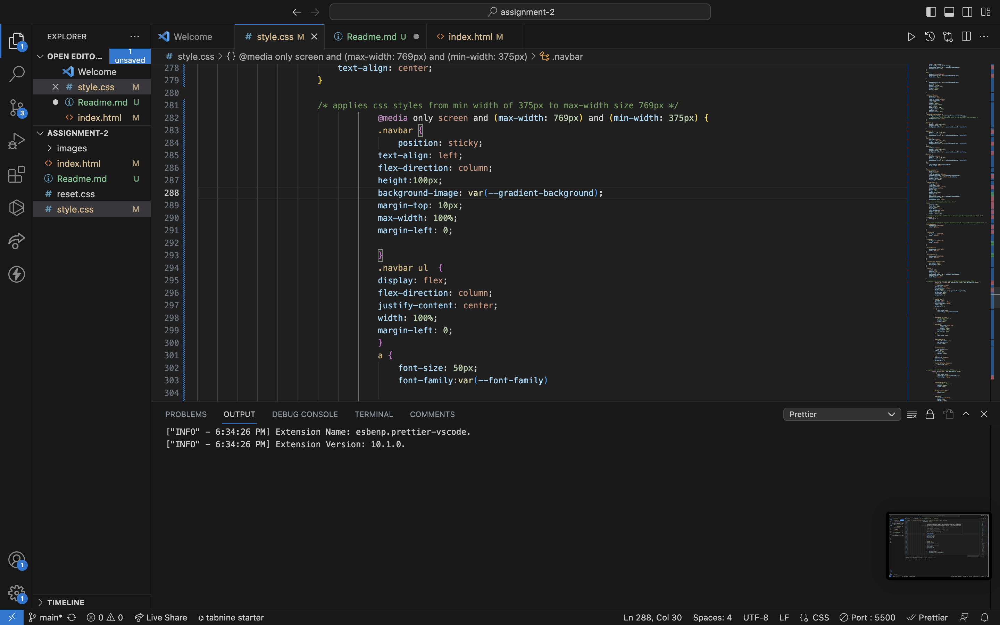
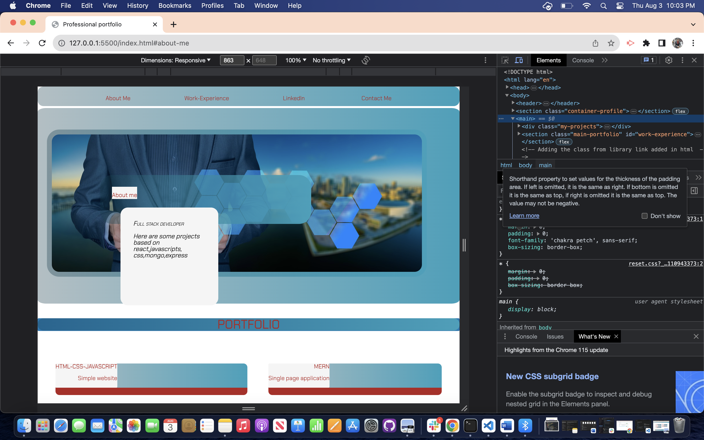
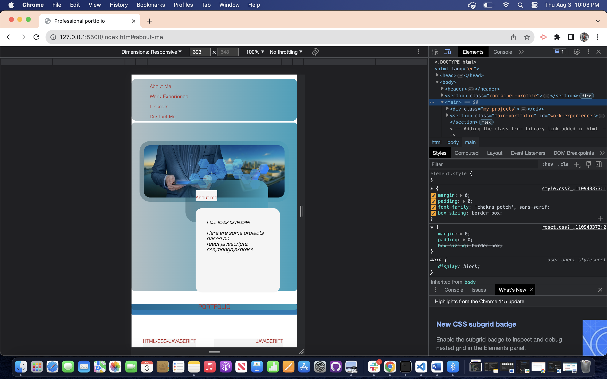

# <Professional Portfolio>

## This project shows how can we present a professional portfolio using CSS and HTML markup.User can understand how we can present a portfolio using CSS and HTML markup by reverse engineering the code and also can understand the usage of advance properties like flexbox, hover, media queries, var properties etc.

-Motivation : My motivation for this project is to help user understand how we can layout our portfolio and most importantantly understand how we can use media queries for usability in different size electronic devices. Also, it helps to understand how we can import the font family, social media buttons from library in this project (font awesome library)

-Reason for this project : To help users understand how we can build a simple html css porfolio linking to inside the section and outside to the particular web page ,for example in social media buttons ,in nav bar. Also how we can media query so that the inferface looks good with the size of the devices.

-Problem this project solved: It helps the users to understand the basic concept of  margin, padding ,border ,background image along with absolute positioning,relative positioning to flex properties,hover,media queries, var section in CSS for repetitive css rule and importing from libraries.

## Usage

Users can reengineeing the code , inspect the html css code and then can have a better understanding of css for make their own project and in this context a portfolio showcase.

Screenshots of some of the work of this project:

## Deployment link
-Please check the deployed link of the website.
-

